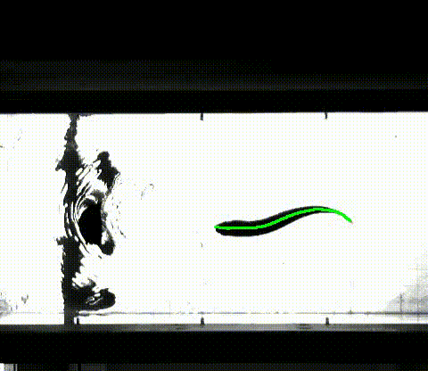
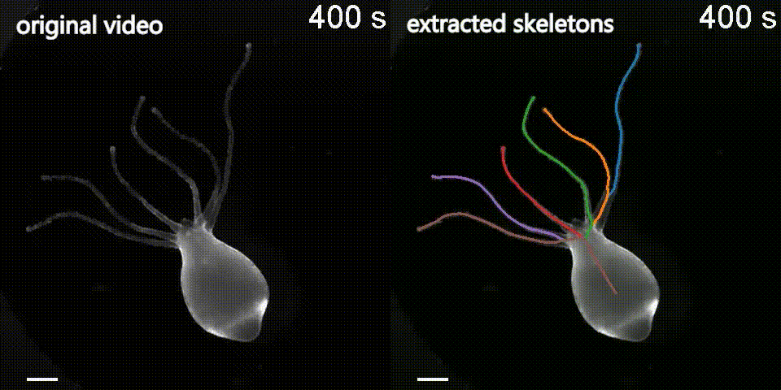
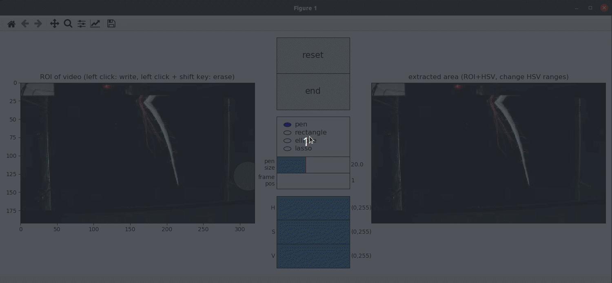
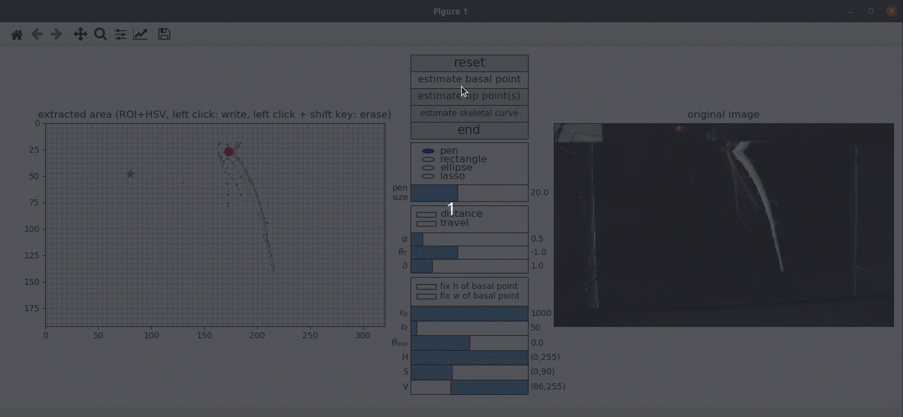

This repository shares the python tools published in **"Skeletonizing the Dynamics of Soft Continuum Body from Video"** 
(https://www.liebertpub.com/doi/full/10.1089/soro.2020.0110).

```bibtex
@article{inoue2021skeletonizing,
  title={Skeletonizing the Dynamics of Soft Continuum Body from Video},
  author={Inoue, Katsuma and Kuniyoshi, Yasuo and Kagaya, Katsushi and Nakajima, Kohei},
  journal={Soft Robotics},
  year={2021},
  publisher={Mary Ann Liebert, Inc., publishers 140 Huguenot Street, 3rd Floor New~…}
}
```





# Skeletonizing soft body
Please run the following script for extracting centerline(s) of soft body recorded in your video.
```sh
$ python src/script/extract_centerline.py
    [-h] [--reset_cache]
    [--warp_threshold WARP_THRESHOLD]
    [--skeleton_num SKELETON_NUM]
    [--frame_offset FRAME_OFFSET]
    [--frame_end FRAME_END]
    [--resize_rate RESIZE_RATE]
    [VIDEO_PATH]
```
The extracted data will be saved on ```[VIDEO_PATH]/raw.pkl``` as default right after terminating the script.

## Optional arguments
|||
|-|-|
|```--reset_cache```| clearing the saved data (raw.pkl)
|```--warp_threshold [float]```| threshold for pausing script when detecting warped pathes (default: inf).
|```--skeleton_num [int]```| # of extracted path (default: 1)
|```--frame_offset [int]```| setting the offset position (default: 0)
|```--frame_end [int]```| setting the end position (default: None)
|```--resize_rate [float]```| setting the resize rate of video (default: 1.0)

## Console commands
|||
|-|-|
|```Space```| pausing / resuming the script
|```Ctrl-c``` or ```ESC```|  terminating the script with saving the extracted paths.
|```Enter```| launching the image editor GUI (when paused)
|```m```| launching the ROI editor GUI (when paused)
|```r```| moving to the offset frame (when paused)
|```x```| moving to the next frame (when paused)
|```z```| moving to the previous frame (when paused)

## ROI editor
ROI and HSV parameters used in the background subtraction process can be edited as follows.


## Image editor
Extracted image by background subtraction can be edited as follows.


|||
|-|-|
|distance| displaying the distance field
|travel| displaying the traveling time field
|fix h | fixing the height (horizontal position) of the basal point
|fix w | fixing the width (vertical position) of the basal point

|||
|-|-|
|**α**| constant value adjusting the convexity of the speed vector field (default: 0.5)
|**θ_T**| boundary threshold for calculating the traveling time field (default: -1.0)
|**δ**| step width used in gradient-descent process (default: 1.0)
|**ε_b**| maximum distance between the current and previous basal point (used in the basal point estimation)
|**ε_t**| maximum distance between the current and previous tip point(s) (used in the tip point(s) estimation)
|**θ_min**| minimum distance between estimated tip points and the edge of the extracted area (default: 0.0).

# Visualization
The following scripts ```create_smoothed_data.py``` and ```create_output_movie.py``` visualize the extracted paths with **colormaps** and **overlaid video** from the data stored in ```[VIDEO_PATH]/raw.pkl```, respectively.

```sh
# Outputting colormaps on [VIDEO_PATH]/smoothed.pdf
# Also smoothed pathes will be saved on [VIDEO_PATH]/smoothed.pdf
$ python src/script/create_smoothed_data.py [VIDEO_PATH]

# rendering overlaid video on ```[VIDEO_PATH]/movie.mp4
# ffmpeg is required to create the video
$ python src/script/create_output_movie.py [VIDEO_PATH]
```

# Short snippet to read data
Also, you can use the following codes to read the extracted data.
```py
import joblib

path = "[VIDEO_PATH]/raw.pkl"
# path = "[VIDEO_PATH]/smoothed.pkl"

with open(path, mode="rb") as f:
    result_data = joblib.load(f)
```

# Installation
## for Ubuntu or MacOS (recommended)
Requirements (recommended)

- [pyenv](https://github.com/pyenv/pyenv)
- [pipenv](https://pypi.org/project/pipenv/)

Please install the following dependencies for pyenv setup
```sh
$ sudo apt install -y make build-essential libssl-dev zlib1g-dev libbz2-dev libreadline-dev libsqlite3-dev wget curl llvm libncurses5-dev xz-utils tk-dev libxml2-dev libxmlsec1-dev libffi-dev liblzma-dev
```

Next, download ```pyenv```
```sh
$ git clone https://github.com/pyenv/pyenv.git ~/.pyenv
$ git clone git://github.com/yyuu/pyenv-update.git ~/.pyenv/plugins/pyenv-update
```

Then, please add the following scripts in ```.bashrc``` or ```.zshrc```
```sh
export PYENV_ROOT="$HOME/.pyenv"
export PATH="$PYENV_ROOT/bin:$PATH"
eval "$(pyenv init -)"
```

Now, it's time to download the python kernel
```
$ pyenv update
$ pyenv install anaconda3-2020.02
$ pyenv local anaconda3-2020.02
$ pip3 install --user pipenv
```
Especially, please install ```anaconda3-2020.02``` to run this program.

```sh
$ pyenv install anaconda3-2020.02
$ conda install -c conda-forge pipenv
$ pipenv --python=$(conda run which python) --site-packages
$ pipenv install
$ pipenv shell
```

## for Windows 10

We recommend to use ```anaconda3``` environment and install the following packages
```
dill==0.3.1.1
multiprocess==0.70.9
numpy==1.18.1
opencv-contrib-python==4.2.0.32
opencv-python==4.2.0.32
parse==1.14.0
pathos==0.2.5
pox==0.2.7
ppft==1.6.6.1
scikit-fmm==2019.1.30
six==1.14.0
